# Anthropic Claude Certified Architect Celebration Trailer

This project documents the creative and technical workflow used to turn an exam milestone into a 75-second cinematic game trailer.

The core idea was simple:

```text
Certification exam = final boss
Exam domains = game levels
Skills = power-ups
Concept mastery = loot drops
Passing = victory frame
```

The final result was a futuristic "Exam Citadel" trailer: a hero enters a certification arena, clears five domain chambers, collects artifacts, defeats the final exam boss, and lands on a corrected certified victory frame.

## Final Format

```text
1920x1080
30 fps
2252 frames
About 75 seconds
```

The final exported MP4 and raw AI video clips are intentionally not committed to this repository because they are large. This repo focuses on the reusable production system: storyboard, prompts, still assets, final-render keyframes, and process notes.

## Visual Storyboard

These stills were generated first and used as the visual anchor for the later video clips.

| Arena Entry | Agentic Architecture | Tools + MCP | Claude Code Workflows |
|---|---|---|---|
| 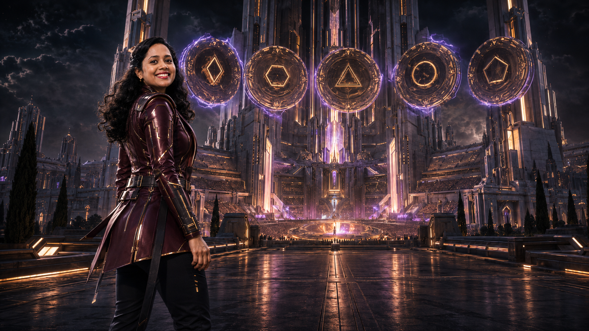 | 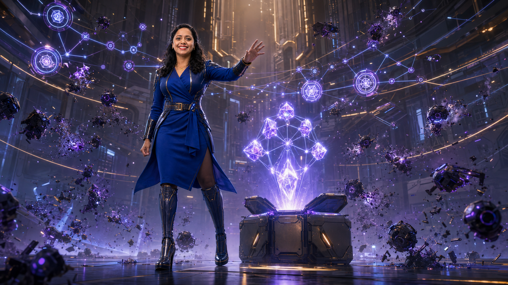 | 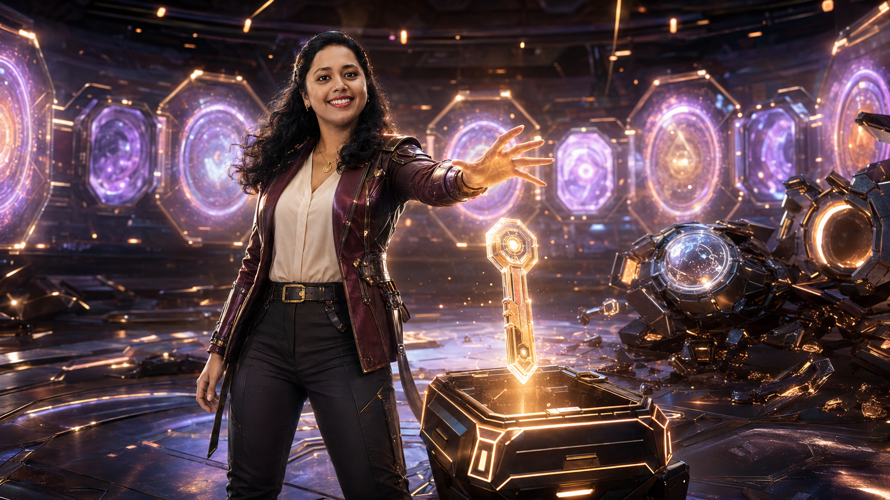 | 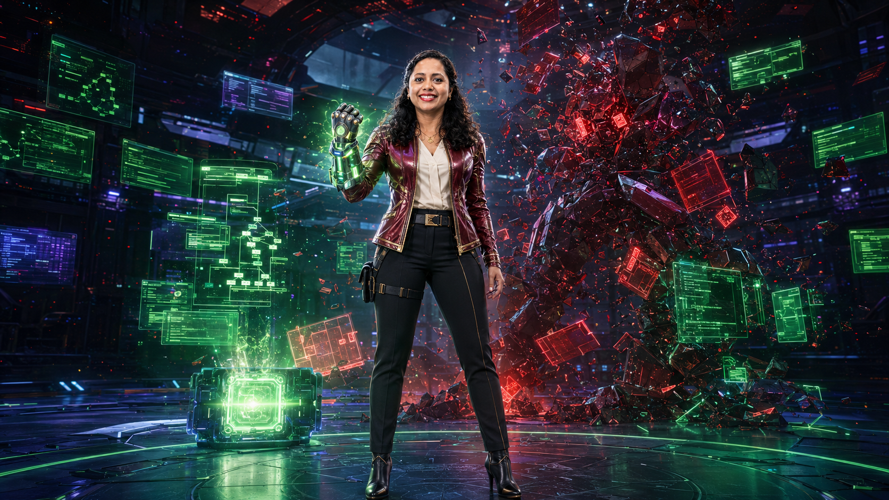 |

| Prompt + Structured Outputs | Context + Reliability | Final Boss | Victory Frame |
|---|---|---|---|
| 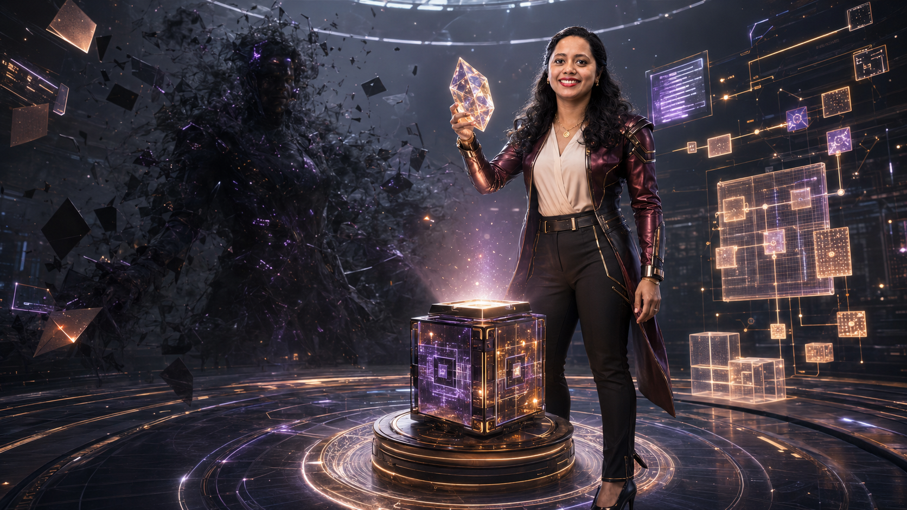 | 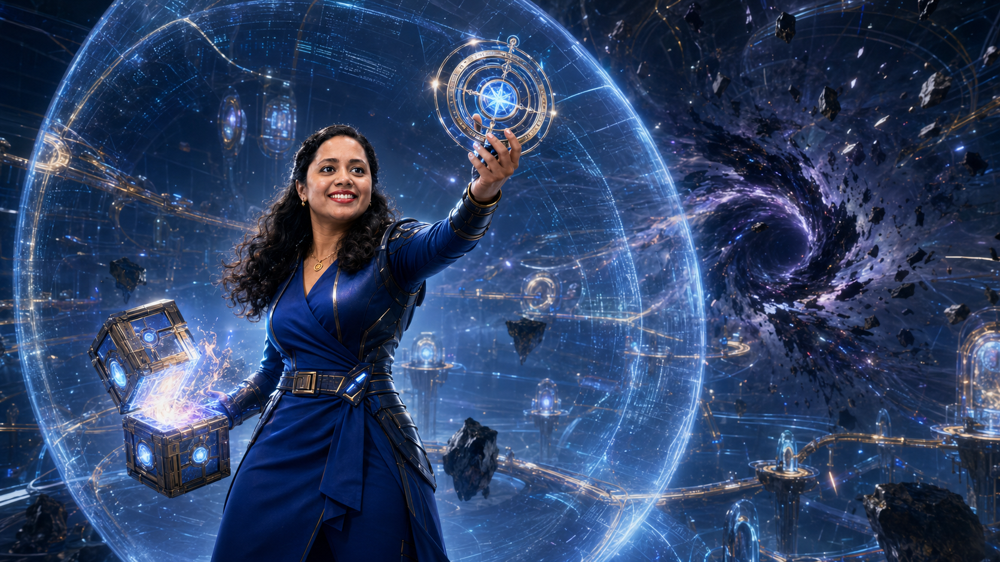 | 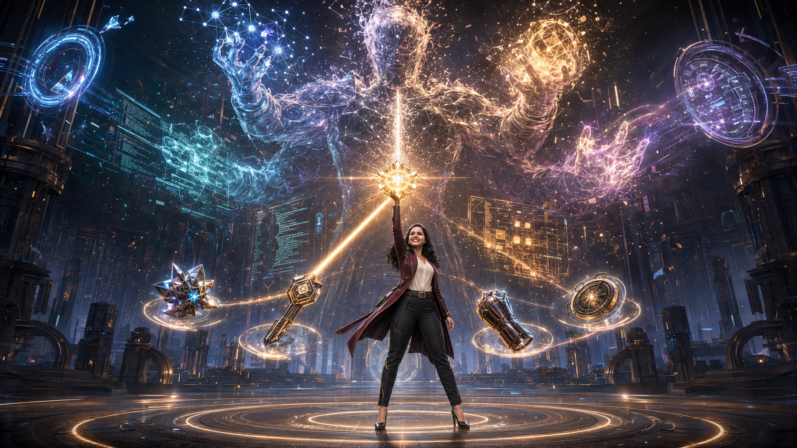 | 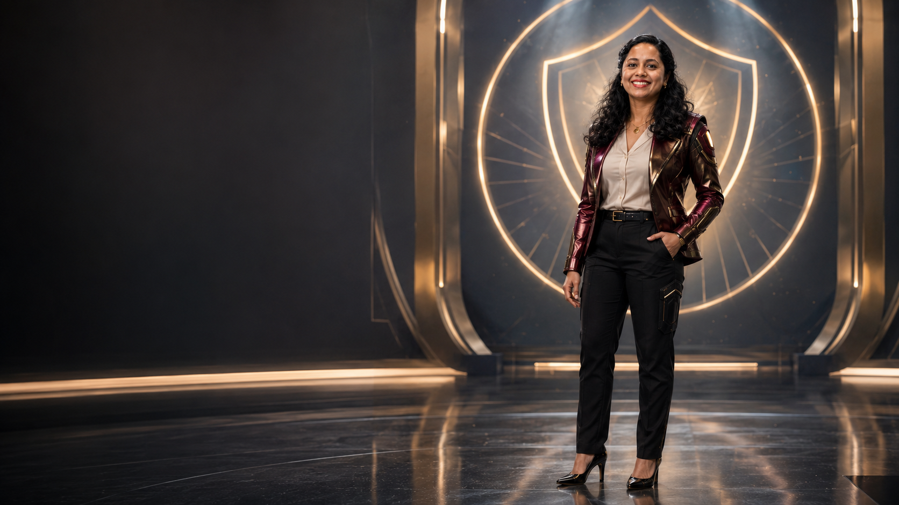 |

## Final Trailer Keyframes

These frames come from the final Remotion render and show how the generated clips were corrected and contextualized with overlays.

| Opening HUD | Level Overlay |
|---|---|
| 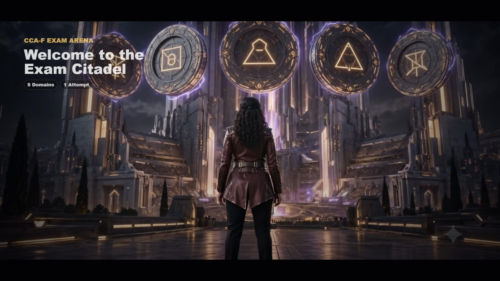 | 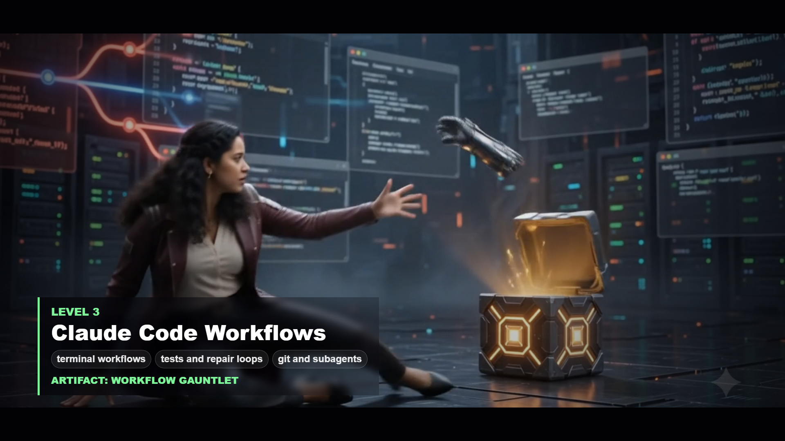 |

| Final Boss | Victory Correction |
|---|---|
| 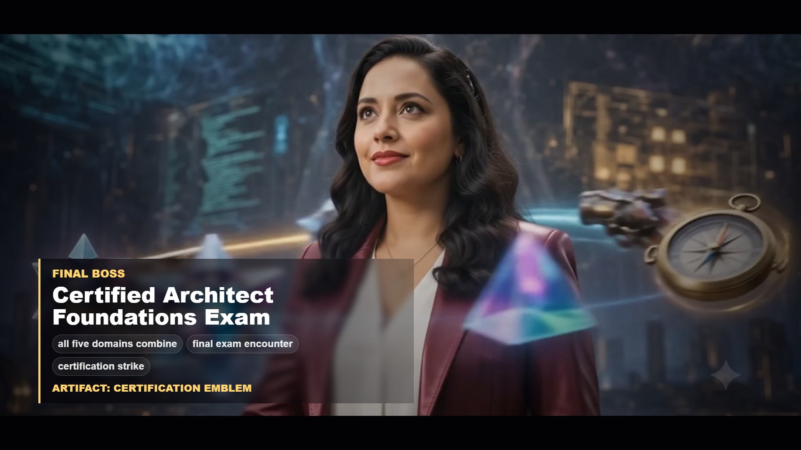 | 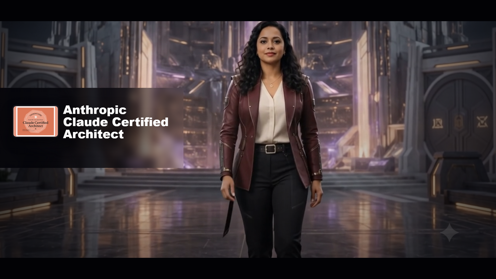 |

## Workflow

### 1. Start With The Metaphor

The project began as a Mario-style certification journey and evolved into a photorealistic futuristic arena. The exam became the final boss. The exam domains became levels. The concepts became loot drops and power-ups.

That metaphor kept the production coherent. Every shot had to answer:

- What exam topic does this level represent?
- What obstacle or boss makes that topic visual?
- What artifact does the hero collect after mastering it?
- How does this unlock the next part of the journey?

### 2. Build The Storyboard

The storyboard defined eight shots:

1. Arena Entry: The Exam Citadel
2. Level 1: Agentic Architecture
3. Level 2: Tools + MCP
4. Level 3: Claude Code Workflows
5. Level 4: Prompt Engineering + Structured Outputs
6. Level 5: Context + Reliability
7. Final Boss: Anthropic Claude Certified Architect Exam
8. Victory Frame: Anthropic Claude Certified Architect

Each level used the same loop:

```text
Enter chamber -> face obstacle -> defeat mini-boss -> collect artifact -> unlock next gate
```

The full storyboard is in [`docs/storyboard.md`](docs/storyboard.md).

### 3. Generate Character And Scene Stills

The protagonist was based on a real photo reference and transformed into a consistent futuristic professional hero: metallic burgundy jacket, cream blouse, black tactical trousers, subtle gold accents, and cinematic game-trailer styling.

The image prompts were written shot by shot so each still already contained the right domain metaphor, artifact, chamber, lighting, and action.

Prompt pack:

- [`prompts/gemini-nano-banana-image-prompts.md`](prompts/gemini-nano-banana-image-prompts.md)

### 4. Animate The Stills Into Video Clips

Each still became a reference frame for an AI video generation prompt. The motion prompts specified camera movement, action beats, artifact reveals, and "no readable text" constraints.

The clip naming convention matters because the Remotion assembly expected canonical filenames:

```text
shot-01-exam-citadel.mp4
shot-02-agentic-architecture.mp4
shot-03-tools-mcp.mp4
shot-04-claude-code-workflows.mp4
shot-05-prompt-structured-output.mp4
shot-06-context-reliability.mp4
shot-07-final-boss.mp4
shot-08-victory-certified.mp4
```

Video prompt pack:

- [`prompts/google-flow-video-prompts.md`](prompts/google-flow-video-prompts.md)
- [`assets/video/README.md`](assets/video/README.md)

### 5. Assemble In Remotion

The first assembly felt like static slides. The better version made the AI-generated clips the primary visual layer and used Remotion as the editorial control layer.

The important Remotion decisions were:

- Use each generated clip at its full length.
- Read real clip durations instead of hardcoding a 60-second timeline.
- Keep overlays brief and useful.
- Put important text in Remotion, not inside generated video.
- Use matte overlays when generated video bakes in incorrect text.
- Preserve cinematic pacing, even if the final trailer extends beyond 60 seconds.

### 6. Review, Correct, Render

The final pass focused on visual clarity:

- The first frame was simplified so the citadel image could breathe.
- The opening text flashes briefly and then disappears.
- Level overlays explain the exam concepts without covering the action.
- The final shot covers incorrect baked-in certification text and replaces it with the correct title.
- A compact certificate badge preview was used instead of a circular crop that cut off important text.

Full production notes are in [`docs/project-creation-brief.md`](docs/project-creation-brief.md).

## Stack Used

- Gemini Nano Banana / image generation for character and scene stills
- Google Flow / AI video generation for image-to-video shots
- Higgsfield exploration for cinematic video models and generation options
- Wan / Qwen-style image-to-video generation experiments
- Remotion for programmable video assembly
- React for composition structure
- CSS for overlays, grading, letterbox treatment, masks, and HUD styling
- `@remotion/media-parser` for reading real clip durations
- Node.js / npm for scripts and render commands
- GitHub for preserving the reusable workflow, prompts, and visual documentation

## Top Lessons

1. Storyboard before generating media.
   AI generation is much easier to direct when every shot already has a purpose, action beat, artifact, and transition.

2. Keep important text out of generated video.
   Generated text can look polished and still be wrong. Put final titles, labels, and certification names in Remotion overlays where they can be edited.

3. Character consistency is still hard.
   Even with a character sheet, the hero's face can shift between clips. Wardrobe, hair, silhouette, and color continuity help, but identity drift remains a real production issue.

4. Programmatic assembly gives control.
   AI tools created the raw cinematic material. Remotion made it possible to time, mask, correct, and structure that material into a coherent trailer.

5. Less overlay is usually better.
   The first frame became stronger after removing extra labels and letting the world image carry the moment.

6. Use real clip durations.
   The final trailer worked better when the timeline respected the full length of each clip instead of forcing everything into a fixed 60-second cut.

7. Save the prompts and decisions.
   The storyboard, prompts, and production brief are as reusable as the final video because they explain how the result was made.

## Reuse This Workflow

To adapt this for another certification, launch, portfolio project, or learning milestone:

1. Replace the certification topic with your own milestone.
2. Break the topic into 4-6 domains or chapters.
3. Turn each domain into a level, obstacle, boss, and artifact.
4. Write still-image prompts first.
5. Use those stills as references for video generation.
6. Assemble the clips in a programmable editor such as Remotion.
7. Keep final text editable in the assembly layer.
8. Document the process, not just the final artifact.

## Repository Map

```text
docs/
  project-creation-brief.md        Full production summary and lessons
  storyboard.md                    Shot-by-shot creative plan
  readme-media/keyframes/          Final trailer screenshots for README

prompts/
  gemini-nano-banana-image-prompts.md
  google-flow-video-prompts.md

assets/
  stills/                          Generated visual anchors for each shot
  video/README.md                  Clip drop-folder naming guide
```

## What Is Not Included

The repository intentionally excludes:

- The full exported trailer MP4
- Raw AI-generated video clips
- Original personal photo references
- Raw certificate image assets

Those files are either large, personal, or credential-specific. The reusable value is the workflow: the story system, prompts, still references, assembly notes, and production lessons.
